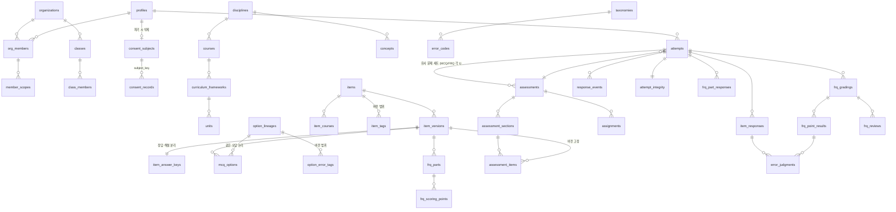

# 통합 설계안 — 새 학습 진단 플랫폼

> PROJECT_BRIEF 0장 2번(+3번 계정 부분) 산출물 · 단계 1-1
> **v4.1 확정 2026-10-01 (v4 승인 + 수정 12건)** · 전제: [현황 분석서](current_state.md) (승인됨)
> 작업명: **platform** (제품 이름은 출시 전 확정)

### v4.1 변경 이력 (v4 승인 시 수정 사항)

| # | 수정 | 반영 위치 |
|---|---|---|
| 1 | 화면 꺼짐 방지 (Screen Wake Lock), 미지원 기기 안내 | 6.4, 14장 |
| 2 | 오프라인 판정 = 기기가 기록한 끊김 구간 안 발생 또는 재전송 이벤트 | 6.5 |
| 3 | 정답 저장 위치를 `item_answer_keys`로 통일, `mcq_options.is_correct` 삭제 | 5.1 |
| 4 | 응시 시작 시 문항 그림 사전 다운로드 | 5.4 |
| 5 | 검토 대기 자동 확정 (기본 48시간) | 6.5, 6.8 |
| 6 | 재개 허용 시 기존 채점 무효 → 최종 제출 후 재채점 | 6.4 |
| 7 | JWT 유효 시간 15분 | 1.2 |
| 8 | 백업 보관 위치·암호화·접근 권한 | 7.1 |
| 9 | 다과정 문항 권한 규칙은 두 번째 과정 추가 시 구현 | 1.4, 12장 |
| 10~12 | 파일럿: 3분 방치 테스트, 기기 이벤트 내보내기, 동의·이탈 기록 안내 | 14장 |

### v4 변경 이력 (v3 검토 의견 24개 반영)

| # | 검토 의견 | 반영 위치 |
|---|---|---|
| 1 | 학생의 정답 정보 접근 차단, 기존 앱 점검 | 5.4, 부록 A |
| 2 | 태그 "정정"과 "변경" 구분, valid_from_version 규칙 | 5.3 |
| 3 | 선택지 계보 = 같은 오답 논리 | 5.2 |
| 4 | 정답 여부가 바뀌면 새 계보, editorial 제한 | 5.2 |
| 5 | JWT에 profile_id | 1.2 |
| 6 | 여러 과정에 속한 문항의 열람·수정 규칙 | 1.4 |
| 7 | 분야 담당자의 과정 펼침, 갱신 지연 명시 | 1.2 |
| 8 | 참고 자료는 화면 내 창 | 6.3 |
| 9 | 하트비트 비저장, 끊김만 기록 | 6.3 |
| 10 | 이탈 경고 팝업, 끊김 안내 팝업 | 6.3 |
| 11 | 이탈 초과 자동 종료 | 6.4 |
| 12~14 | 유예 시간 축소, 오프라인 답 변경은 교사 검토, 마감 연장 시 재계산 | 6.5 |
| 15 | 파기 후 재식별 경로 차단 | 2.5 |
| 16~17 | 유사 문제 세트 규칙 | 6.8 |
| 18 | 과거 응시 포인트 이전 조건 | 10.2 |
| 19~20 | 재발률 비교군, 블라인드 태깅 표본 | 6.9 |
| 21~22 | 출시 범위 추가·축소 | 12장 |
| 23 | 내부 파일럿 포함 | 14장 |
| 24 | 기존 앱 복원 시험 | 13장 (스크립트 준비 완료, 실행은 보류) |

> v3까지의 변경(버전 계보, 범위 컬럼 직접 보유, 이탈·끊김, 마감 유예, 가명 처리, 범위 조정 등)은 본문에 통합돼 있다.

---

## 0. 확정된 전제

| 항목 | 결정 |
|---|---|
| 프로젝트 | 새 저장소 + 새 Supabase(개발·운영) + 새 Vercel. 검증된 코드는 옮겨 쓴다 |
| 기존 앱 | 새 앱 출시 전까지 단독 운영한다. 계속 개발할 수 있다. **DB 스키마는 변경하지 않는다** (부록 A의 RLS 문제는 기존 앱에 적용하지 않고 새 프로젝트에서 해결) |
| 서비스 형태 | 멀티테넌트. 출시 전에는 데이터 구조(org_id, RLS)만 구현하고 기관 1개를 직접 등록. 관리 화면·MFA 등은 F |
| 과목 | AP Chem 먼저. 다른 화학 과정·다른 분야로 확장 가능하게 |
| 시험 엔진 | MCQ·FRQ 통합 엔진 하나. 시험 유형은 설정 |
| 계정 | 최고 관리자 / 과목별 선생님 / 과목별 TA / 학생. 이메일 + 비밀번호 |
| 권한 | TA는 문항·시험의 생성·수정·삭제 불가. 선생님은 담당하지 않는 과목 열람 불가. 모든 학생은 이메일 있음 |
| 기존 데이터 | FRQ 콘텐츠는 이전. 학생 응시는 "과거 응시" 경로만 열어 두고 출시 직전에 결정 |
| 파일럿 | P2 후 2~4주, 1개 반 내부 파일럿 (14장) |
| 일정 | 2027년 1월 목표, 완성도 우선 |

### 단계 표기

| 표기 | 단계 |
|---|---|
| **P-1** | 기존 앱 안전 조치 (정기 백업, 이름 덮어쓰기 제거. 복원 시험·완전 백업은 보류) |
| **P0** | 기반 (저장소, Supabase 개발·운영, CLI 마이그레이션, 백업·복원 훈련, CI) |
| **P1** | 기관 데이터 구조, 계정·권한, 과목 계층, 클래스·배정, 시험 엔진 골격 |
| **P2** | MCQ: 문항은행, PDF 추출 v1, 응시(이탈·끊김·자동 종료 포함), 원자료, 규칙 채점 |
| **P2.5** | **내부 파일럿** (MCQ, 1개 반, 2~4주) |
| **P3** | FRQ: 문항은행, 채점 모듈 이식, 검수, 콘텐츠 이전 |
| **출시 준비** | 부하 테스트, 운영 DB 복원 훈련 |
| **출시** | AP Chem. 기존 앱 종료 |
| **E1 / E2 / F** | 출시 후 확장 / FRQ 오류 판정 / 최종 형태 |

---

## 1. 멀티테넌트와 권한 판단

### 1.1 원칙
1. 기관 소유 데이터는 전부 `org_id`를 가진다.
2. 기관 경계는 RLS가 강제한다.
3. 공용 기준 데이터(분야, 과정, 교육과정, 단원, 공통 개념, 오류 분류 체계)는 플랫폼 소유다.
4. Storage 경로는 `org/<org_id>/...`이고, Storage RLS가 이를 검사한다.
5. AI 비용, 예산, 규칙 설정은 기관 단위다.

### 1.2 JWT 클레임 (검토 의견 5·7)
로그인과 토큰 갱신 때 **Custom Access Token Hook**이 다음 클레임을 넣는다.

```json
{
  "pid": "<profiles.id>",                       // 학생 ID 겸 사람 ID → my_profile_id()가 테이블 조회 없음
  "orgs": {
    "<org_id>": { "role": "teacher", "courses": ["<course_id>", "..."], "admin": false }
  }
}
```

- **분야 단위 담당자**(예: Chemistry 전체)는 토큰을 만들 때 **그 분야의 과정 목록으로 펼쳐서** `courses`에 넣는다. RLS는 과정 ID만 비교한다.
- ⚠️ **반영 지연:** 그 분야에 새 과정을 추가하거나 담당 과목을 바꾸면, 해당 사용자의 **토큰이 갱신될 때 반영**된다. **JWT 유효 시간은 15분**으로 줄여(Supabase Auth 설정 `jwt_expiry=900`) 반영 지연을 최대 15분으로 제한한다 (기본 1시간 대비 토큰 갱신 요청은 4배지만 부담은 작다). 관리 화면에 이 사실을 안내하고, 즉시 반영이 필요하면 "다시 로그인"을 요청한다.
- **정지 처리는 즉시 막는다.** 클레임만 믿지 않고, 쓰기 경로에서 `org_members.status`를 확인하는 함수를 함께 쓴다.
- 기관 관리자는 `admin: true`이고 그 기관의 모든 과정에 접근한다.

### 1.3 대량 테이블의 범위 컬럼 직접 보유
`attempts`, `response_events`, `item_responses`, `frq_part_responses`, `frq_gradings`, `frq_point_results`, `frq_reviews`, `error_judgments`, `similar_assignments`는 **`org_id`, `course_id`, `student_id`를 직접 가진다.**

- 값은 INSERT 트리거가 부모(attempt)에서 복사하고, 이후 변경은 금지한다.
- 인덱스는 `(org_id, course_id, student_id)`에 둔다.
- **교직원 정책** (조인 없음):
  ```sql
  using ( (auth.jwt()->'orgs'->(org_id::text)) is not null
          and ( jwt_org_admin(org_id) or course_id = any(jwt_courses(org_id)) ) )
  ```
- **학생은 이 테이블들을 직접 읽지 못한다** (5.4). 정답 여부·채점 결과가 들어 있기 때문이다. 학생 데이터는 서버 API가 `pid` 기준으로 걸러서 내려준다.

### 1.4 여러 과정에 속한 문항 (검토 의견 6)
`items.course_ids uuid[]`는 `item_courses`에서 트리거로 동기화하는 캐시다.

> **v4.1 범위:** 출시 전에는 **데이터 구조(`item_courses`, `course_ids`)만** 둔다. 과정이 AP Chem 하나뿐이므로 출시 시점 RLS는 "문항의 과정 = 담당 과정" 단순 비교로 충분하다. 아래 규칙과 해당 RLS 테스트는 **두 번째 과정을 추가할 때** 구현한다.

| 동작 | 선생님 | TA | 최고 관리자 |
|---|---|---|---|
| 열람 | 문항의 과정 중 **하나라도** 담당하면 가능 (`course_ids && jwt_courses`) | 같음 (읽기 전용) | 가능 |
| 내용 수정·새 버전 | 문항의 **모든 과정을** 담당할 때만 (`course_ids <@ jwt_courses`) | 불가 | 가능 |
| 과정별 필드 (`item_courses`의 난이도 등) | 그 과정을 담당하면 가능 | 불가 | 가능 |
| 과정 추가 | 추가할 과정을 담당하면 가능 | 불가 | 가능 |
| 과정 제거 | 제거할 과정을 담당하면 가능. 단, 마지막 과정은 제거 불가 | 불가 | 가능 |
| 모든 과정을 담당하지 않을 때 수정 | **"복제해서 내 과정용 새 문항"**으로 진행 (`origin_item_id` 연결) | — | — |
| 태그 | 개념·오류 태그는 문항 공통이라 내용 수정과 같은 규칙. 스킬 태그는 과정별 스킬 체계라 그 과정 담당자 | 불가 | 가능 |

**RLS 테스트 (P1 완료 기준)**
- 기관 간 누출
- 과정 간 누출
- 다과정 문항의 열람 허용과 수정 거부
- TA의 모든 쓰기 거부
- 학생의 정답 테이블 직접 조회 거부
- 정지된 사용자의 쓰기 거부

---

## 2. 계정

### 2.1 역할

| 역할 | 범위 | 권한 | 출시 |
|---|---|---|---|
| 플랫폼 관리자 | 전체 | 기관·공용 기준 데이터 (출시 전에는 DB 작업으로 대체) | F (화면) |
| 최고 관리자 | 기관 | 선생님·TA와 과목 지정, 설정, 모든 과정, 비용, 복원, 파기 처리 | 출시 전 |
| 선생님 | 지정 과정 | 문항은행, 시험, 클래스·학생, 검수, 집계, 이탈 검토·재개 허용 | 출시 전 |
| TA | 지정 과정 | 검수, 명단·배정, 응시 현황 (문항·시험 쓰기, 설정, 비용 불가) | 출시 전 |
| 학생 | 본인 | 응시, 공개된 결과, 복습 | 출시 전 |
| 학부모 | 연결된 자녀 | 리포트 | F |

### 2.2 테이블

| 테이블 | 핵심 컬럼 | 단계 |
|---|---|---|
| `profiles` | id(학생 ID, 독립 UUID), auth_user_id(unique, ON DELETE SET NULL), name, email, locale, pseudonymized_at | P1 |
| `organizations` | name, slug, status, settings | P1 |
| `org_members` | org_id, profile_id, role, status, display_name(기관별 표시 이름), student_no, joined_at, left_at | P1 |
| `member_scopes` | member_id, scope_type(discipline/course), scope_id | P1 |
| `platform_admins` | profile_id | P1 (테이블만) |
| `classes`, `class_members` | org_id, course_id, name, term / class_id, profile_id, role | P1 |
| `consent_subjects` | subject_key(난수), student_id — **파기 시 삭제되는 연결 고리** | P1 |
| `consent_records` | org_id, **subject_key**, guardian_name, consent_type, consented_at, method, recorded_by, **retain_until** | P1 |
| `erasure_log` | profile_id, erased_at, scope(org/account) — 개인정보 없음. 백업 복원 후 파기 재적용에 사용 | P1 |
| `guardian_links` | org_id, guardian_id, student_id | F |

### 2.3 학생 ID
- 학생 ID는 `profiles.id`다. 모든 원자료의 FK이고, JWT `pid`로 전달된다.
- 기관별 학번은 `org_members.student_no`, 표시 이름은 `display_name`이다.

### 2.4 로그인
- 이메일 + 비밀번호, 초대 방식으로 계정 생성, 재설정 메일
- 평문 비밀번호 사본 없음
- 학생 단일 세션(기관 설정), 미배정 차단, 로그인 시도 제한

### 2.5 탈퇴·파기와 재식별 차단 (검토 의견 15)

**계정 파기 절차** (출시 전에는 `scripts/erase-student` 스크립트, 화면은 출시 후)
1. `profiles`: name·email → NULL, `pseudonymized_at` 기록. Auth 사용자 삭제.
2. `org_members`: display_name·student_no 삭제. joined_at·left_at은 **월 단위로 절삭**한다.
3. `class_members`: 행은 반별 과거 통계를 위해 남긴다. 단, 추가 시각·추가자는 절삭·삭제한다.
4. `attempts`: user_agent·device 세부 정보를 삭제한다 (기기 지문이 될 수 있음).
5. 답안 이미지(Storage)를 삭제한다. FRQ 답안 텍스트는 기본 유지하되, 기관 설정으로 삭제할 수 있다 (질문 13).
6. `consent_subjects`의 연결 행을 삭제한다. 동의 기록은 `retain_until`까지 남지만 **학생 ID와 다시 연결할 수 없다.** 보존 기한이 지나면 자동 삭제한다.
7. `erasure_log`에 profile_id와 시각만 남긴다.

**재식별 경로 차단**

| 경로 | 차단 방법 |
|---|---|
| 동의 기록 | 별도 키(`subject_key`)로만 연결하고 파기 시 연결을 끊는다. 법정 보존 기간 후 자동 삭제 |
| `audit_log`의 before/after | **개인정보 필드는 값 대신 "변경됨"만 기록.** 엔티티별 허용 필드 목록(allowlist) 방식으로, 목록에 없는 필드는 저장하지 않는다 (name, email, display_name, student_no, phone, 답안 텍스트 등은 제외) |
| 소속·반 정보 | 2~3번 처리 (시각 절삭) |
| 기기 정보 | 4번 처리 |
| **백업** | 운영 DB 백업 보존 기간을 정한다: 일일 30일, 주간 12주. 넘으면 자동 삭제한다. 백업에서 복원하면 `erasure_log`를 다시 적용하는 단계를 복원 절차에 필수로 넣는다 |

**남는 위험:** 학생 수가 아주 적은 반에서는 "그 기간 그 반의 학생"만으로도 추정이 가능할 수 있다. 이런 경우 리포트에서는 소규모 그룹 집계를 숨기는 기준(예: 5명 미만)을 둔다 (E1).

---

## 3. 과목 계층

```
disciplines → courses → curriculum_frameworks(버전) → units
concepts(분야 소속) ── concept_unit_map ── units
concept_links (선수·인접·분야 간)
skill_frameworks / skills (과정별)
```

새 과목을 추가할 때 코드는 바꾸지 않는다. 기준 데이터만 입력한다.

---

## 4. 오류 분류 체계

| 테이블 | 핵심 |
|---|---|
| `taxonomies` | discipline_id, org_id(F), name, version, frozen_at |
| `error_codes` | code, category, definition, criteria, introduced_in, status(active/retired), retired_in |
| `error_code_mappings` | from → to, change_type(merge/split/redefine) |

**폐기 코드와 재판정 (`v_rejudge_queue`)**

| 변경 유형 | 처리 |
|---|---|
| merge | 집계 시 새 코드로 자동 환산. 대기열에 넣지 않음 |
| redefine | 자동 반영 |
| split, 또는 매핑 없는 폐기 | **"재판정 필요"** 대기열. 다시 판정하면 새 행 추가 |

교사 화면의 대기열은 E1에 만든다. 대기 중인 코드는 확정 약점 집계에서 제외한다.

---

## 5. 문항은행

### 5.1 테이블

| 테이블 | 핵심 컬럼 | 단계 |
|---|---|---|
| `items` | org_id, display_code, item_type, source, origin_item_id, distribution_allowed, status, current_version_id, **course_ids[]**(캐시), deleted_at | P2 |
| `item_versions` | item_id, version_no, change_class, stem, content(jsonb), asset_paths[], representation, is_calculation, change_note, created_by, locked_at | P2 |
| `item_answer_keys` | item_version_id, correct_option_id(MCQ), **explanation**, explanation_assets[] — **정답의 유일한 저장 위치** (v4.1). FRQ의 채점 기준은 frq_scoring_points가 같은 "key" 등급으로 보호된다 | P2 |
| `item_courses` | item_id, course_id, difficulty_est, difficulty_observed | P2 |
| `option_lineages` | id, item_id, created_in_version, note | P2 |
| `mcq_options` | item_version_id, option_lineage_id, label, position, content, origin, replaces_lineage_id (**정답 여부 컬럼 없음** — 정답은 `item_answer_keys.correct_option_id`만) | P2 |
| `part_lineages`, `point_lineages` | FRQ 계보 | P3 |
| `frq_parts` | item_version_id, part_lineage_id, label, position, points, command_verb, depends_on[] | P3 |
| `frq_scoring_points` | part_id, point_lineage_id, position, criterion, points, acceptable_alternates[], notes | P3 |
| `item_tags` | **item_id**, (part_lineage_id), tag_kind(concept/skill), ref_id, is_primary, **valid_from_version, valid_to_version**, edit_kind(correction/change), tagged_by, tagging_confidence, needs_review, blind, tagging_run_id, recorded_at, superseded_by | P2 (입력은 CSV) |
| `option_error_tags` | **option_lineage_id**, primary_code_id, other_code_ids[], error_path, diagnostic_power, **valid_from_version, valid_to_version**, edit_kind, tagged_by, blind, recorded_at, superseded_by | P2 (입력은 E1) |
| `point_error_tags` | point_lineage_id, expected_code_ids[], 같은 버전 범위 컬럼 | E2 |

### 5.2 버전과 계보 (검토 의견 3·4)

**버전 생성:** 응시 전에는 그 자리에서 수정한다. 응시에 쓰인 버전은 잠기고, 수정하면 새 버전이 생긴다.

**변경 등급**

| 등급 | 허용되는 변경 | 시스템 강제 |
|---|---|---|
| `editorial` | 지문의 오탈자·서식, 그림 해상도 | **정답이 바뀌거나 선택지 내용이 하나라도 바뀌면 선택할 수 없음** (서버가 차이를 비교해 거부) |
| `substantive` | 지문·조건·수치 변경, 선택지 수치 변경 | 정답이 바뀌면 이 등급 이상 필수 |
| `option_replace` | 선택지 교체 | 교체된 선택지는 새 계보 필수 |

**선택지 계보의 정의**
- 계보는 문구가 아니라 **"같은 오답 논리(같은 오류 경로)"**를 뜻한다.
- 예를 들어 "몰 비를 뒤집어 계산한 값" 선택지는 문제의 수치가 바뀌어 값이 0.25에서 0.40이 되어도 **같은 계보**다.
- 계보가 끊기는 경우는 세 가지다.
  - 오답 논리가 달라졌을 때 (교사가 판단해 "새 계보" 지정. 시스템은 오류 경로 설명이 다르거나 내용 차이가 큰 선택지에 제안)
  - **정답 여부가 바뀌었을 때** (오답 → 정답 또는 그 반대. 시스템이 강제로 새 계보 생성)
  - 선택지를 교체했을 때 (`option_replace`)

FRQ의 파트·채점 포인트 계보도 같은 정의를 따른다. 기준은 "같은 채점 기준 논리"다.

**통계 통합:** `editorial` 버전끼리는 문항 정답률을 합산한다. 선택지별 선택률과 오류 통계는 계보 단위로 합산한다 (버전 등급과 무관).

### 5.3 태그 "정정"과 "변경" (검토 의견 2)
태그 행은 **적용 버전 범위** `[valid_from_version, valid_to_version]`을 가진다. `valid_to_version`이 NULL이면 열린 범위다.

| 구분 | 의미 | 처리 |
|---|---|---|
| **정정 (correction)** | 원래부터 틀렸던 태그를 바로잡음 → **모든 버전에 적용** | 새 행을 **같은 범위**로 만들고, 옛 행은 `superseded_by`=새 행 |
| **변경 (change)** | 문항이 바뀌어 버전 N부터 태그가 달라짐 → **N부터 적용** | 옛 행의 `valid_to_version = N-1` (superseded 아님), 새 행 `valid_from_version = N` |

**응답 해석 규칙:** 버전 v에 대한 응답의 유효 태그는 다음 조건을 모두 만족하는 행이다.
- `superseded_by IS NULL`
- `valid_from_version ≤ v`
- `valid_to_version IS NULL` 또는 `v ≤ valid_to_version`

같은 대상에 여러 행이 남으면 `recorded_at`이 가장 늦은 행을 쓴다.

- **새 버전을 만들 때는 태그를 복사하지 않는다.** 열린 범위가 자동으로 이어진다.
- `substantive` 버전이 생기면 열린 범위 태그에 `needs_review` 검토 요청이 생긴다. 검토 결과는 "유지", "정정", "변경(N부터)" 중 하나다.
- 모든 행은 지우지 않는다. 이력은 `recorded_at`과 `superseded_by`로 남는다.

### 5.4 정답 정보 접근 차단 (검토 의견 1)

**원칙: 학생은 문항·정답·채점 관련 테이블을 직접 읽을 수 없다.**

| 테이블 | 학생 직접 접근 |
|---|---|
| items, item_versions, item_answer_keys, mcq_options, frq_parts, frq_scoring_points, 태그·계보 전부 | **정책 없음 (차단)** |
| assessments, assessment_items | 차단 |
| attempts, item_responses, response_events, frq_*, error_judgments | 차단 (쓰기도 서버 경유) |
| profiles(본인), org_members(본인), 배정 목록 뷰 | 본인 행만 읽기 |

**서버 경유 API (service role + `pid` 강제 필터)**

| API | 내려주는 것 | 조건 |
|---|---|---|
| `GET /api/attempts/:id/content` | 지문, 그림(서명 URL), 선택지 id·라벨·내용, 파트 라벨·배점 | 본인 응시가 진행 중일 때 |
| `GET /api/attempts/:id/state` | 본인 응답 스냅샷 (선택한 선택지, 다시 보기 표시, 남은 시간) | 본인 응시 |
| `GET /api/attempts/:id/result` | 점수, 정오, **해설**, 채점 결과·루브릭 근거 | **결과 공개 이후에만** |

- **정답 여부·해설·루브릭은 content API의 직렬화 대상에서 아예 빠진다.** 허용 필드 목록 방식이고, 테스트로 검증한다.
- **결과 공개 조건:** `settings.result_release` (즉시 / 교사 승인 후 / 응시 기간 종료 후) + 응시 상태 확정(채점 완료).
  - 모의고사는 **"응시 기간 종료 후"**를 기본값으로 한다. 먼저 끝낸 학생의 결과가 아직 응시 중인 학생에게 퍼지지 않게 하기 위해서다.
- **Storage 분리:**
  - 문항 그림 `org/<org>/items/<id>/stem/...`
  - 해설·루브릭 자산 `org/<org>/items/<id>/key/...`
  - `key/` 경로는 결과 공개 후 서버가 서명한 URL로만 내려준다.
- **그림 사전 다운로드 (v4.1):** 응시를 시작하면 기기가 **모든 문항 그림을 먼저 받아 기기 저장소(Cache Storage/IndexedDB)에 보관**한 뒤 첫 문항을 연다. 응시 중 끊김이 생기거나 서명 URL이 만료돼도 그림은 기기 사본으로 표시한다. 서명 URL 유효 시간은 응시 시간 + 30분이다. 진행 상황("문항 준비 중 12/60")을 보여주고, 실패한 그림은 재시도한다. 모든 그림을 받기 전에는 시작 타이머가 돌지 않는다. 사본은 제출하면 삭제한다.
- **응시 중 채점 결과 노출 방지:** `item_responses.is_correct`는 유예 종료 후 채점할 때 처음 채워진다. 학생은 result API로만 볼 수 있다.

> **기존 앱 점검 결과는 부록 A.** 정답·루브릭 유출은 없지만, 별도의 RLS 문제 3건을 발견했다.

---

## 6. 시험 엔진

### 6.1 시험 세트

| 테이블 | 핵심 컬럼 |
|---|---|
| `assessments` | org_id, course_id, title, exam_type, status, folder_id, opens_at, closes_at, time_limit_minutes, settings, is_system_generated, origin_attempt_id, similar_kind(mcq/frq), deleted_at |
| `assessment_sections`, `assessment_items` | 섹션, 문항 버전 고정 |
| `assignments` | assessment_id, class_id 또는 student_id, opens_at, closes_at, **extra_minutes**(개별 추가 시간) |
| `attempts` | 범위 컬럼, assessment_id, attempt_no, status, started_at, submitted_at, **deadline_at, grace_until**, end_reason(manual/deadline/away_limit/teacher), needs_review, auto_submitted, device_type, user_agent, source(live/legacy_import), legacy_ref, clock_offset_ms, clock_anomaly, last_heartbeat_at, **away_allowance_bonus**, rules_ack_at, result_released |

**`settings` 키**

| 그룹 | 키 |
|---|---|
| 일반 | confidence_enabled, confidence_scale, reference_materials[], result_release, grading_mode, single_session |
| 마감 | `late_sync_grace_seconds` (기본 **180**), `pending_review_timeout_hours` (기본 **48**) |
| 이탈 | `away.warn` (기본 켜짐), `away.autoterminate.enabled` (기본 **꺼짐**), `away.autoterminate.max_count`, `away.autoterminate.max_total_seconds` (선택), `away.min_seconds` (기본 3), `away.include_network` (기본 꺼짐), `away.highlight_threshold` |

### 6.2 응답 원자료

| 테이블 | 핵심 컬럼 |
|---|---|
| `response_events` | 범위 컬럼, assessment_item_id, event_type, payload, client_event_id(유일), client_seq, client_ts, server_ts, **status(accepted/rejected/pending_review)**, reason |
| `item_responses` | 범위 컬럼, assessment_item_id, item_version_id, selected_option_id, is_unanswered, flagged, change_count, student_confidence, total_time_ms, away_time_ms, away_count, offline_time_ms, is_correct, scored_at |
| `frq_part_responses` | 범위 컬럼, assessment_item_id, frq_part_id, answer_text, image_paths[] |
| `attempt_integrity` | attempt_id, away_count(집계 대상), away_total_ms, longest_away_ms, offline_count, offline_total_ms, grace_accepted_count, pending_review_count, clock_anomaly |

**전송 방식**
- 이벤트는 기기에서 **묶음 전송**한다 (2~5초 또는 20개마다, 응답 입력 시에는 즉시).
- 순서는 `client_seq`, 중복 방지는 `client_event_id`로 한다.

### 6.3 이벤트, 이탈·끊김, 팝업 (검토 의견 8·9·10)

**이벤트 종류**

| 분류 | event_type | 비고 |
|---|---|---|
| 시작 | `rules_ack` | 시작 전 안내 확인. payload에 그 시점의 이탈 규칙 설정 스냅샷 |
| 문항 | `item_enter`, `item_leave` | |
| 응답 | `select`, `clear`, `flag`, `unflag`, `confidence`, `answer_save` | |
| 참고 자료 | `ref_open`, `ref_close` | **앱 화면 안의 창(모달·패널)으로 연다.** 새 탭·외부 링크는 쓰지 않는다. 이탈로 세지 않는다 |
| 화면 이탈 | `page_hidden`, `page_visible`, `window_blur`, `window_focus` | hidden과 blur가 겹치면 하나의 이탈로 합친다 |
| 네트워크 | `net_offline`, `net_online` | **끊김을 감지했을 때만** 기록한다. 감지 방법: online/offline 이벤트, 전송 실패, 하트비트 실패. 끊긴 동안은 기기 큐에 쌓였다가 복구 후 전송 |
| 팝업 | `warning_shown`, `warning_ack`, `notice_shown` | payload: 종류, 표시 당시 이탈 횟수 |
| 종료 | `terminated` | 서버가 결정한 자동 종료를 기기가 받은 시점 |

**하트비트는 이벤트로 저장하지 않는다.** 30초마다 `attempts.last_heartbeat_at` 한 칸만 갱신한다. 학생 80명이면 분당 약 160회 단일 행 갱신이다. 하트비트가 끊기는 것이 서버 쪽 끊김·이탈 추정의 근거가 된다.

**시간 지표**
- `total_time_ms`: 기본값. 이탈 시간을 포함한다.
- `away_time_ms`, `away_count`: 화면 이탈. `away.min_seconds` 미만은 집계에서 제외하되 원자료는 남긴다.
- `offline_time_ms`: 화면은 보이는 상태에서 네트워크가 끊긴 시간
- 화면이 숨겨진 상태라면 끊김 여부와 관계없이 이탈로 센다.

**팝업**

| 상황 | 팝업 | 문구 예시 |
|---|---|---|
| 화면 이탈 후 복귀 (집계 대상 이탈) | **경고** (확인을 눌러야 닫힘) | "시험 화면을 벗어났습니다. **이탈 2회** / 3회 초과 시 시험이 자동 종료됩니다." (자동 종료가 꺼져 있으면 "이탈 기록은 선생님께 전달됩니다.") |
| 네트워크 끊김 | **안내** (응시를 막지 않는 배너) | "인터넷 연결이 끊겼습니다. 답안은 기기에 저장 중이며, 연결되면 자동 전송됩니다." |
| 네트워크 복구 | 안내 (자동으로 닫힘) | "연결되었습니다. 저장된 답안을 전송했습니다." |

- 팝업의 이탈 횟수는 기기가 먼저 계산해 보여준다. 다음 동기화 때 **서버가 확정한 횟수로 바로잡는다.**
- 팝업을 띄운 사실과 확인 버튼을 누른 사실도 이벤트로 남긴다.

**교사 화면 (출시 전):** 응시 결과에 숫자로 표시한다.
- "화면 이탈 3회 · 2분 10초"
- "네트워크 끊김 1회 · 40초"
- "유예 채택 2건 · 검토 대기 1건"

문항별 상세 화면과 그래프는 출시 후에 만든다.

### 6.4 이탈 초과 시 자동 종료 (검토 의견 11)

**판정은 서버가 한다.**
- 서버는 이벤트를 받을 때마다 `attempt_integrity`를 다시 계산한다.
- 집계 대상 이탈은 `away.min_seconds` 이상인 것이다. `away.include_network`가 꺼져 있으면 끊김은 제외한다.
- 기기가 보낸 횟수는 참고만 하고 판정에 쓰지 않는다.

**종료 조건:** 다음 중 하나라도 해당하면 종료한다 (설정이 켜진 경우).
- 집계 이탈 횟수 > `max_count + away_allowance_bonus`
- `max_total_seconds`가 설정돼 있고, 누적 이탈 시간이 이를 넘음
- **복귀하지 않는 이탈:** 마지막 이벤트가 `page_hidden`이고 하트비트가 끊긴 채 누적 기준을 넘음. 서버의 지연 판정(sweep)이 처리한다.

**종료 처리**
1. 그 시점까지 채택된 답안으로 자동 제출한다 (`status=submitted`, `end_reason=away_limit`, `needs_review=true`).
2. 기기는 다음 동기화 때 종료 사실을 받고 입력을 잠근 뒤 안내 화면을 보여준다.
3. 교사 화면의 "검토 필요" 목록에 올린다.

**교사의 재개 허용 (오탐일 때)**
- `status=in_progress`로 되돌리고, `away_allowance_bonus`를 늘린다 (기본 +2).
- 마감 시각은 그대로 둔다. 필요하면 6.5의 연장 규칙을 함께 적용한다.
- 결정자, 사유, 시각을 `audit_log`에 남긴다.
- **채점 처리 (v4.1):** 자동 종료 시점에 이뤄진 채점(MCQ 규칙 채점, FRQ AI 채점, 검토 대기 결정)은 **무효 처리**한다 (`is_current=false`, superseded_reason=`resumed`). 그 응시로 만든 유사 문제 세트가 있으면 아직 시작 전인 경우에만 취소한다 (시작된 세트는 6.8의 불변 규칙대로 유지하고 교사 화면에 표시). 학생이 **최종 제출한 뒤 처음부터 다시 채점**한다. 유사 문제 세트도 그 뒤에 만든다.

**화면 꺼짐 방지 (v4.1)**
- 응시가 시작되면 **Screen Wake Lock API**로 화면 꺼짐을 막는다. 탭이 다시 보일 때마다 다시 요청한다(브라우저가 숨김 시 자동 해제하므로).
- **지원하지 않는 기기·브라우저**에서는 시작 전 안내 화면에 "이 기기는 화면 자동 꺼짐을 막을 수 없습니다. 설정에서 화면 자동 꺼짐 시간을 시험 시간보다 길게 늘려 주세요."를 표시하고, 확인 항목에 포함한다.
- Wake Lock 획득 실패·해제를 `payload`에 기록한다 (`wakelock_acquired`, `wakelock_released`). 이 기록으로 "화면 꺼짐으로 인한 이탈"을 다른 이탈과 구분할 수 있다.
- 화면 꺼짐으로 인한 이탈이 자동 종료로 이어지지 않는지 **파일럿에서 검증**한다 (14장).

**시작 전 안내 화면**
- 시험 시간, 마감, 이탈 규칙(경고 방식, 자동 종료 기준, 제외되는 짧은 이탈, 네트워크 끊김 처리), 참고 자료 사용법을 보여준다.
- 학생이 **확인 체크**를 해야 시작 버튼이 활성화된다. 이때 `rules_ack` 이벤트와 `rules_ack_at`이 기록된다.

**오탐 가능성:** 태블릿 알림 배너, 화면 분할, OS 팝업, 화면 자동 꺼짐 등이 이탈로 잡힐 수 있다. 그래서 기본값은 "자동 종료 꺼짐"이다. 파일럿(14장)에서 사례를 모아 기본 임계값을 정한다.

### 6.5 마감, 유예, 연장 (검토 의견 12·13·14)

**기준 시각:** 서버 시각이다. 기기와의 시각 차이(`clock_offset_ms`)는 전송이 성공할 때마다 측정한다. 화면 타이머는 서버 시각 기준으로 돌아간다.

**마감 시각 계산 (`recompute_deadline(attempt)`)**
```
window_close = coalesce(배정별 closes_at, 시험 closes_at)
time_close   = started_at + (time_limit_minutes + 배정별 extra_minutes)
deadline_at  = min(window_close, time_close)          -- NULL이면 그 항목은 무시
grace_until  = deadline_at + late_sync_grace_seconds  -- 기본 180초 (설정 범위 120~300)
```

**판정 규칙**

| 이벤트 | 조건 | 처리 |
|---|---|---|
| 모든 이벤트 | 보정 시각 > deadline_at | `rejected` (after_deadline). 원자료는 저장 |
| 모든 이벤트 | 서버 도착 > grace_until | `rejected` (late_sync). 원자료는 저장 |
| 응답 변경 이외 (이동, 다시 보기, 이탈 등) | 마감 전 발생 + 유예 중 도착 | `accepted` → "유예 채택" 건수에 포함 |
| **응답 변경** (select, clear, answer_save) | 마감 전 발생 + 유예 중 도착 + **오프라인 이벤트** (아래 정의) | **`pending_review`** (자동 채택 안 함). 채점은 서버가 마지막으로 확인한 답으로 하고, 교사 승인 시 반영해 다시 채점 |
| 응답 변경 | 마감 전 발생 + 유예 중 도착 + 오프라인 이벤트가 아님 (온라인에서 즉시 전송했는데 도착만 늦음) | `accepted` |

**오프라인 이벤트의 정의 (v4.1):** 다음 중 하나에 해당하는 이벤트다. **온라인 상태에서 처음 전송된 이벤트는 도착 시각과 관계없이 오프라인으로 보지 않는다.**
1. 기기가 기록한 끊김 구간(`net_offline` ~ `net_online`) **안에서** 발생한 이벤트
2. 첫 전송이 **실패해서 재전송된** 이벤트. 기기는 전송 시도 횟수 `send_attempt`를 이벤트에 붙이고, 2 이상이면 재전송이다.

서버는 이 둘을 `payload.offline=true`로 표시하고, 판정 근거(구간 / 재전송)를 함께 남긴다.
| 시각 이상 | 응시 중 offset 변화 ≥ 2분, 시간 역행, 시작 전 시각 | `clock_anomaly` + 교사 검토. 이후 이벤트는 서버 도착 시각으로만 판정 |

- 교사 화면에 "유예 채택 n건", "검토 대기 m건"을 표시한다. 검토 대기 건은 이벤트 단위로 승인·거부하며, 결정은 `audit_log`에 남긴다.
- FRQ 답안에 검토 대기가 있으면 **결정이 날 때까지 그 문항의 AI 채점을 미룬다.**
- **자동 확정 (v4.1):** 검토 대기가 `pending_review_timeout_hours`(기본 **48시간**, 기관·시험 설정) 안에 결정되지 않으면 **마지막으로 확인된 답(대기 이벤트를 채택하지 않은 상태)으로 자동 확정**한다 (`status=rejected`, reason=`review_timeout`). 그 뒤 채점과 유사 문제 세트 생성이 이어진다. 교사 화면에 "자동 확정됨" 표시를 남긴다.

**응시 중 마감 연장**

| 연장 방식 | 처리 |
|---|---|
| 시험 또는 배정의 `closes_at` 변경 | 영향받는 **진행 중** 응시 전부에 `recompute_deadline` 실행 |
| 개별 추가 시간 (`extra_minutes`, 편의 제공 등) | 해당 학생의 진행 중 응시 재계산 |
| 단축 | 진행 중 응시의 새 마감이 `now() + 5분`보다 이르면 거부한다 (응시 중인 학생 보호) |
| 이미 마감·제출된 응시 | 자동으로 다시 열지 않는다. 교사가 "응시 재개"를 명시적으로 실행해야 하며, 이때 새 마감으로 재계산 |

- 기기는 다음 동기화 응답(묶음 전송·하트비트 응답에 deadline_at 포함)에서 새 마감을 받아 타이머를 고친다. 학생에게 "마감이 연장되었습니다" 안내를 띄운다.
- 모든 변경은 `audit_log`에 남긴다.

### 6.6 채점

| 테이블 | 핵심 |
|---|---|
| MCQ | 유예 종료 후 규칙 채점 → `item_responses.is_correct` |
| `grading_profiles` | course_id, prompt_template, model, version |
| `frq_gradings` | 범위 컬럼, item_version_id, profile_version, model, run_path, usage, result(jsonb), needs_review, is_current, superseded_at |
| `frq_point_results` | 범위 컬럼, frq_grading_id, point_lineage_id, earned, earned_points, evidence, reasoning |
| `frq_reviews` | 범위 컬럼, 대상, adjusted_points, comment, reviewed_by, is_current |

### 6.7 오류 판정
- `v_mcq_observed_errors`: 응답 → 선택지 계보 → 응시 버전 기준 유효 태그 (5.3 규칙) → 관찰 오류 후보. merge 환산을 포함한다.
- `error_judgments`: 범위 컬럼, target, correctness, primary/secondary codes, observation, hypothesis, diagnostic_confidence, judged_by_type, taxonomy_version, supersedes_id

### 6.8 유사 문제 세트 (검토 의견 16·17)

| 규칙 | 내용 |
|---|---|
| 생성 대상 | `exam_type ≠ similar`인 시험의 응시만. **유사 문제 세트의 응시에서는 새 세트를 만들지 않는다** |
| 개수 | 원 응시 1회당 **MCQ 세트 최대 1개 + FRQ 세트 최대 1개** (`unique(origin_attempt_id, similar_kind)`) |
| MCQ 세트 생성 시점 | 유예 종료 후 MCQ 규칙 채점이 끝나고, 응시의 **pending_review가 모두 결정(또는 48시간 자동 확정)된 뒤** |
| FRQ 세트 생성 시점 | 그 응시의 **FRQ 채점과 필요한 검수가 모두 끝난 뒤**. 제공은 E2부터 (E 계열은 FRQ 판정이 필요하므로) |
| 불변성 | 세트는 생성할 때 문항이 확정된다. **응시가 시작된 세트에는 문항을 추가하지 않는다.** 나중에 재채점으로 오답이 바뀌어도 기존 세트는 그대로 두고, 차이는 교사 화면에 표시한다 |
| 표시 | `is_system_generated=true`이므로 교사 시험 목록에서는 숨긴다. 학생에게는 "○○ 복습 문제 (객관식 / 서술형)"로 표시한다 |

**MCQ와 FRQ를 나눈 이유:** MCQ는 응시 직후 확정되므로 빠른 복습이 가능하다. FRQ는 채점·검수를 기다려야 해서, 하나로 묶으면 MCQ 복습까지 늦어진다.

### 6.9 리포트와 평가 지표 (검토 의견 19·20)

**진단고사 리포트 (E1):** Project 2의 샘플 리포트 시안을 기준으로 한다. 화면 + PDF.

**평가 지표 뷰 (E1. 데이터는 출시일부터 쌓임)**

| 뷰 | 지표 |
|---|---|
| `v_eval_similar_uptake` | 유사 문제 풀이율 |
| `v_eval_recurrence` | 재발률. 학생 × 오류 코드에서 유사 문제 이후 같은 코드가 다른 문항에서 다시 관찰된 비율. **비교군 3개:** ① 배정받아 푼 학생 ② 배정받았지만 풀지 않은 학생 ③ (가능하면) 배정 기능 이전 기간 |
| `v_eval_family_compare` | C1·E 계열과 나머지의 재발률 감소 비교 (위 비교군별) |
| `v_eval_supply_gaps` | 보충 필요 조합 수와 추이 |
| `v_eval_tagging_agreement` | **블라인드 표본만으로 계산** (아래) |
| `v_eval_ops` | 검수 건수, 검수 소요 시간 |

> 재발률 비교는 관찰 데이터라 선택 편향이 있다. 유사 문제를 푸는 학생은 원래 성실할 수 있다. 리포트에 이 한계를 명시한다.

**블라인드 태깅 표본**
- `tagging_audits` 테이블을 둔다: sample_id, item_id, 대상(개념, 스킬, 선택지 오류), 추출 방법(무작위), 배정된 교사, 완료 시각.
- 표본은 무작위로 뽑는다 (예: 태깅된 문항의 10%, 최소 30문항).
- 교사 화면은 **AI 태그를 숨긴 "블라인드 태깅" 모드**로 열린다. 저장된 태그는 `blind=true`.
- 일치도는 같은 대상에 대한 블라인드 교사 태그와 AI 태그의 쌍으로만 계산한다. AI 결과를 보고 수정한 일반 검수 태그는 쓰지 않는다.

---

## 7. 운영·공통

| 테이블 | 핵심 |
|---|---|
| `app_settings` | org_id, key, value |
| `ai_usage_log` | org_id, purpose, model, run_path, usage, cost_usd(Batch 할인 반영) |
| `cost_settings`, `budget_approvals` | 기관별 월 예산 |
| `audit_log` | org_id, actor, action, entity, entity_id, **changes(허용 필드만 값 기록, 개인정보 필드는 "변경됨")**, at |
| `notifications` | 교사 알림 |
| 백업 | 7.1 참조 |

---

### 7.1 백업 보관·암호화·접근 (v4.1)

| 항목 | 규칙 |
|---|---|
| 1차 백업 | Supabase 관리형 일일 백업(Pro 요금제 기능, 서비스 측 저장 암호화) |
| 2차 백업 (자체) | 주 1회 `pg_dump` + Storage 사본. **생성 즉시 암호화**(AES-256, `gpg --symmetric` 또는 `age`)한 파일만 남긴다. 평문은 디스크에 쓰지 않거나(파이프로 바로 암호화), 작업 폴더에서 즉시 삭제 |
| 보관 위치 | 개인 컴퓨터가 아니라 **접근 통제된 저장소**: 운영자 소유의 별도 클라우드 버킷(비공개, 버전 관리·삭제 보호 켬) 1곳 + 오프라인 외장 저장소 1곳(선택). 개인 PC에는 복원 작업 중에만 임시로 둔다 |
| 키 관리 | 암호화 비밀번호(또는 키)는 비밀번호 관리자에 보관. 백업 파일과 같은 곳에 두지 않는다. 키 분실 시 복원 불가이므로 2곳 보관 |
| 접근 권한 | 최고 관리자(운영자) 1인. 버킷 접근 키는 백업 스크립트 전용(쓰기 전용 권한)과 복원용(읽기)을 분리 |
| 보존 기간 | 일일 30일, 주간 12주. 만료분은 버킷 수명 주기 규칙으로 자동 삭제 |
| 복원 | 복원 훈련은 개발 프로젝트로만. 복원 후 `erasure_log` 재적용 필수 |
| 기존 앱 (P-1) | 같은 원칙을 지금부터 적용: 주간 논리 백업 스크립트가 **암호화 파일만** 남기도록 수정. **2026-10-01 백업(현재 바탕화면 평문 폴더)은 암호화 후 평문 삭제** — 운영자 승인 후 실행 |

## 8. 엔티티 관계도



---

## 9. 모듈 구조

```
lib/
  core/          supabase, auth(JWT 클레임 pid·orgs), tenancy, sessions, storage(stem/key 분리 서명), audit(allowlist)
  billing/       ai-usage, 비용, 예산 가드
  reference/     과목 계층, 오류 코드, 재판정 대기열
  itembank/      items, versions(잠금·등급 강제), lineages, answer keys, tags(범위·정정/변경), course 권한
  assessment/    시험 세트·설정, 배정, recompute_deadline, attempts, 재개
  responses/     묶음 이벤트 수집(멱등·시각 보정·마감/유예/검토 판정), 스냅샷, integrity 계산, 자동 종료 판정
  delivery/      학생용 content/state/result API (허용 필드 직렬화, 결과 공개 조건)
  scoring/       mcq, frq(기존 엔진 이식), 검수
  taxonomy/      관찰 오류 뷰, error_judgments
  analytics/     집계, 평가 지표, 진단 리포트
  remediation/   유사 문제 세트 (E1)
  privacy/       파기·가명 처리, erasure 재적용
scripts/         extract-pdf, import-tags-csv, import-legacy-frq, erase-student, seed-org, backup, restore-drill, loadtest
app/             (auth) · org/ · teach/ · learn/ · admin/(F)
```

---

## 10. 기존 앱 데이터 이전

### 10.1 콘텐츠 이전 (P3, 출시 직전)
- 문항 13개 → items/versions. 정답·해설에 해당하는 루브릭은 `item_answer_keys`와 FRQ 파트·포인트로 옮긴다.
- 루브릭 → frq_parts/frq_scoring_points (계보 새로 부여)
- 이미지는 `stem/`과 `key/`로 나눠 복사한다.
- 단원 → item_courses + 단원 매핑

### 10.2 "과거 응시" 가져오기 경로 (실행 여부는 출시 직전 결정)
- `attempts.source='legacy_import'`, `legacy_ref`를 둔다. 학생은 이메일로 매칭한다.
- 답안 → `frq_part_responses` (문항 전체 단위)
- **채점 이전 조건 (검토 의견 18):**
  - 기존 `gradings.guideline_version` = 이전 시점의 `scoring_guidelines.version`이면 → `frq_gradings`(원본 JSON) + **`frq_point_results`** (포인트 배열 위치로 계보 대응)
  - **다르면** → `frq_gradings.result`에 **원본 JSON만 보존**하고 포인트 행은 만들지 않는다 (`legacy_rubric_mismatch=true`). 기존 앱은 루브릭을 덮어써서 당시 루브릭 내용을 복원할 수 없기 때문이다.
- 검수 → frq_reviews (파트 단위, 같은 조건)
- 이벤트 원자료가 없으므로 "과거 응시" 배지를 달고, 시간·이탈 기반 지표에서는 제외한다.

---

## 11. 비용
- 현재 실측 (2026-09): 88건에 약 $3.5. 목표 규모 추산(월 $120~400)은 **잠정**이다.
- **보류 (운영자 결정):** AP FRQ 실측(E2 출력 증가분 포함)과 절감 검토(출력 길이 제한, 캐싱, 이미지 압축)는 **P3 시작 전**에 실행한다.

---

## 12. 기능 분류: 출시 전 필수 / 출시 후 (검토 의견 21·22)

| 영역 | 출시 전 필수 | 출시 후 |
|---|---|---|
| 기반 | 개발·운영 분리, CLI 마이그레이션, 자동 백업(보존 기간·자동 삭제), CI·RLS 테스트, 메일 발송, **새 운영 DB 백업 복원 훈련**, **동시 접속 부하 테스트** | — |
| 보안 | **정답 정보 접근 차단** (학생 직접 접근 0, 서버 API 허용 필드, stem/key 분리, 결과 공개 조건) | — |
| 멀티테넌트 | org_id·RLS, JWT 클레임(15분), 기관 1개 직접 등록, 다과정 문항 **데이터 구조만** | 다과정 권한 규칙·테스트 (두 번째 과정 추가 시), 기관·플랫폼 관리 화면, 기관별 코드, 콘텐츠 공유 (F) |
| 계정 | 이메일+비밀번호, 초대, 재설정, 4개 역할, 과정 범위, 표시 이름, 단일 세션, 동의 기록(분리 키) | MFA, 학부모 (F), 데이터 내보내기 |
| 개인정보 | **파기 스크립트** (`erase-student`), audit allowlist, erasure 재적용 | 파기 처리 화면 |
| 과목 | 계층 구조, AP Chem 기준 데이터 | 다른 과정·분야 콘텐츠 |
| 문항은행 | MCQ·FRQ, 버전·등급 강제·계보, 정답 분리 저장, 검수, PDF 추출 v1, 콘텐츠 이전 | 전체 추출, 새 문항 유형 |
| 태깅 | 태그 테이블(범위·정정/변경) + **CSV 가져오기** | 태그 입력 화면, AI 태깅 파이프라인, 블라인드 태깅 화면 (E1), FRQ 포인트 태깅 (E2) |
| 시험 엔진 | 시험 세트·설정, 배정·연장 재계산, 재응시, 통합 플레이어, 다시 보기, **화면 내 참고 자료**, 자동 저장·재개, **시작 전 규칙 안내·확인**, **이탈 경고·끊김 안내 팝업**, **자동 종료 설정과 서버 판정**, 교사 재개 허용 | 확신도, 2단계 추가 문항 (E1) |
| 원자료 | 이벤트 전부, 묶음 전송, 시각 보정, 마감·유예·검토 판정 | — |
| 채점 | MCQ 규칙, FRQ AI(이력·정규화·과정별 프롬프트), Batch, 검수, 예산 가드 | 포인트별 오류 코드 후보 (E2) |
| 교사 화면 | 응시 현황, 결과, 검수, **이탈·끊김·유예 숫자 표시**, 검토 대기 승인, 자동 종료 검토, 알림 | 이탈 상세·그래프, 오류 집계·재판정 대기열 (E1) |
| 학생 화면 | 응시, 공개된 결과(점수 중심), 오답 | 복습 세트 (E1) |
| 분석 | 단원·문항 정답률 | 단순 집계, 평가 지표, 진단 리포트 (E1), 통합 (E2), 약점 상태 (F) |

**부하 테스트 기준:**
- 학생 80명 동시 응시. 문항당 이벤트 약 5개, 2~5초 묶음 전송, 하트비트 30초
- 마감 시각에 동시 제출하고, 유예 시간 동안 큐가 몰리는 상황 포함
- 통과 조건: p95 응답 1초 이내, 오류 0, 이벤트 유실 0

**복원 훈련 기준:** 새 운영 DB 백업으로 빈 프로젝트에 복원 → 행 수·파일 해시 일치 → `erasure_log` 재적용 확인 → 소요 시간 기록

---

## 13. 개발 계획 반영 사항 (5번 산출물에서 상세화)

### P-1. 기존 앱 안전 조치

| 작업 | 상태 |
|---|---|
| 주 1회 이상 백업 (완전 백업 준비 전까지 논리 백업 스크립트) | 진행 예정 |
| 학생 로그인 시 이름 덮어쓰기 제거 (코드만 변경) | 진행 예정 |
| DB 스키마 변경 금지 | 적용 중 |
| **복원 시험 (검토 의견 24):** 빈 Supabase 프로젝트에 마이그레이션 합본 SQL 실행 → `restore.mjs`로 사용자·행·파일 복원 → 행 수·sha256 자동 검증 | **보류 (운영자 결정 2026-10-01)**. 스크립트는 준비 완료, 실행 시점: 완전 백업과 함께 |
| RLS 긴급 수정 3건 (부록 A) | **적용 안 함 (운영자 결정 2026-10-01).** 새 프로젝트 설계에 반영 (5.4, 1.3: 학생 직접 쓰기·삭제 경로 없음). 주 1회 백업으로 훼손 시 복구 |
| 완전 백업 (`pg_dump`) | 보류 (기존 DB 작업 전·콘텐츠 이전 전) |

---

## 14. 내부 파일럿 (P2.5, 개발 계획 포함)

| 항목 | 내용 |
|---|---|
| 대상·기간 | 1개 반(5~10명), 2~4주. MCQ 모의고사는 새 앱, FRQ는 기존 앱 |
| 전제 | P0~P2 완료, 새 운영 DB, 초대·로그인, 백업, 복원 훈련 1회, **파일럿 학생 전원의 보호자 동의 기록(`consent_records`)**, **학생·보호자에게 "응시 중 화면 이탈·네트워크 끊김이 기록되며 선생님이 확인한다"는 사실 사전 안내** (안내문 + 시작 전 화면) |
| 환경 | **학원 와이파이 + 가정**, **태블릿 + PC 혼합**, 브라우저 2종 이상 |
| 의도적 실패 테스트 | ① 마감 1~2분 전 와이파이 차단 → 유예 중 복구 / 유예 후 복구 ② 응시 중 탭 강제 종료·기기 재시작 → 재개 ③ 기기 시계를 수 분 틀리게 설정 ④ 응시 중 다른 앱 전환·화면 분할·알림 배너 ⑤ 같은 계정으로 두 번째 기기 로그인 ⑥ 응시 중 교사가 마감 연장 ⑦ **태블릿을 만지지 않고 3분 이상 방치** (Wake Lock 동작, 미지원 기기의 화면 꺼짐 → 이탈 기록 → 자동 종료로 이어지지 않는지) |
| 오탐 수집 | 이탈 경고·자동 종료(파일럿에서는 **켠 반과 끈 반**, 또는 경고만)를 상황별로 기록. 알림 배너, 화면 분할, 화면 꺼짐, 키보드 팝업 → **기본 임계값(min_seconds, max_count) 조정** |
| 디버그 도구 | **기기 이벤트 기록 내보내기:** 학생 화면의 숨은 메뉴(또는 교사가 발급한 일회용 코드)로 기기의 IndexedDB 이벤트 큐·전송 기록 전체를 JSON 파일로 내보내거나 서버에 업로드한다. 이 파일과 서버의 `response_events`를 `client_event_id`로 대조하는 스크립트(`scripts/reconcile-device-log`)로 유실 여부를 판정한다. 파일럿 이후에는 교사 요청 시에만 쓰는 지원 도구로 유지 |
| 통과 기준 | 응답 유실 **0건** (기기 이벤트 내보내기 ↔ 서버 대조) · 재개 성공률 **100%** (테스트 시나리오 전부) · 마감·유예 판정 오류 0건 · 기기별 렌더링 문제(화학식·그림·참고 자료) **0건** · 이탈 지표 오탐 사례를 전부 분류·설명 가능 · 학생 불편 사항 중 응시 방해 0건 · **화면 꺼짐·방치로 인한 자동 종료 0건** · 온라인 즉시 전송 응답이 검토 대기로 빠진 사례 0건 |
| 파일럿 후 | 구조 변경은 **데이터 마이그레이션으로 처리**한다 (파일럿 데이터 보존, 새 운영 DB 유지). 파일럿 결과 보고서 → P3·출시 준비에 반영 |

---

## 15. 확인이 필요한 사항 (6번 질문 목록에 포함 예정)

1~3. (확정) TA 쓰기 불가 / 타 과정 열람 불가 / 이메일 필수
4. 메일 발송 서비스
5. FRQ 답안: 파트별 입력 + 문항 전체 사진 병행안
6. FRQ 답안 자동저장 스냅샷 수집 여부
7. PDF 추출·태깅 로컬 CLI 실행안
8. Markdown + KaTeX/mhchem 저장안
9. 보호자 동의 기록 방식, 법정 보존 기간
10. 제품 이름·도메인
11. Vercel·Supabase 요금제
12. 이탈 기본값 (min_seconds 3초, 경고 켜짐, 자동 종료 꺼짐) — 파일럿 후 확정
13. 파기 시 FRQ 답안 텍스트 기본 처리
14. 모의고사 결과 공개 기본값 = "응시 기간 종료 후"
15. 백업 보존 기간 (일일 30일 / 주간 12주)
16. 소규모 그룹 집계 숨김 기준 (5명 미만)
17. ~~기존 앱 RLS 긴급 수정~~ → 기존 앱에는 적용 안 함, 새 프로젝트에 반영 (확정)
18. 검토 대기 자동 확정 시간 기본값 48시간 (확정, 설정 가능)
19. 2차 백업 저장소 선택 (클라우드 버킷 종류)

---

## 부록 A. 기존 앱 보안 점검 (검토 의견 1)

**정답·루브릭 유출: 없음**
- `scoring_guidelines`(루브릭)는 RLS상 staff 전용이다. 루브릭 이미지가 있는 `exam-assets` 버킷도 staff 전용이다.
- 문항(`questions`)에는 정답 필드가 없다.
- 학생이 읽을 수 있는 `gradings`(본인 것)는 채점이 끝난 뒤에만 생기고, 기존 앱은 채점 즉시 결과를 공개하므로 노출 시점이 같다.
- 작은 예외: Batch 채점 중에는 문항별 결과가 하나씩 들어오므로, 학생이 API를 직접 호출하면 화면보다 조금 일찍 일부 결과를 볼 수 있다. 영향은 낮다.

**대신 발견한 문제 3건** (학생이 브라우저의 공개 키와 자기 로그인 세션으로 Supabase API를 직접 호출하면 가능)

| # | 문제 | 원인 | 영향 |
|---|---|---|---|
| A1 | **제출이 끝난 자기 답안을 삭제할 수 있음** | `answers_student_rw`가 `for all` 정책이다. `with check`(제출 전만 허용)는 INSERT·UPDATE에만 적용되고, **DELETE는 `using`(본인 소유)만 검사**한다 | 원자료 훼손. 재채점 시 "무응답"이 됨 |
| A2 | **제출이 끝난 자기 답안 이미지를 삭제·덮어쓰기할 수 있음** | Storage `answers` 버킷의 학생 delete·update 정책이 제출 상태를 확인하지 않음 | 원본 이미지 훼손·교체 |
| A3 | **자기 프로필의 `status`(정지 해제), `email`, `created_by`를 바꿀 수 있음** | `profiles_update_self`의 `with check`가 `role`만 고정함 | 정지된 학생의 자가 해제, 표시 이메일 변조 |

**수정 방법 (정책 3개 교체, 테이블 구조 변경 없음)**
- A1: `for all` 정책을 SELECT / INSERT / UPDATE로 나누고, 학생 DELETE 정책은 없앤다.
- A2: 학생 Storage delete·update 정책에 "해당 제출이 `in_progress`일 때만" 조건을 추가한다.
- A3: 학생의 프로필 직접 수정 정책을 없앤다 (앱은 이미 서버에서 수정하므로 기능 영향 없음).

**결정 (2026-10-01): 기존 앱에는 적용하지 않는다.** 새 프로젝트는 학생의 직접 쓰기·삭제 경로가 없는 구조(5.4)라 같은 문제가 생기지 않으며, RLS 테스트에 A1~A3 재현 시나리오를 포함한다. 아래는 당시 검토한 내용이다.

~~권장:~~ "스키마 변경 금지" 원칙의 예외로 이 3건만 고치는 안을 검토했다.
- 테이블·데이터는 건드리지 않고 정책만 바꾸며, 되돌리는 SQL도 함께 준비한다.
- 먼저 **복원 시험 프로젝트(13장)에서 공격 재현 → 수정 → 앱 정상 동작을 확인**한 뒤 운영에 적용한다.
- 운영자 승인이 필요하다.
